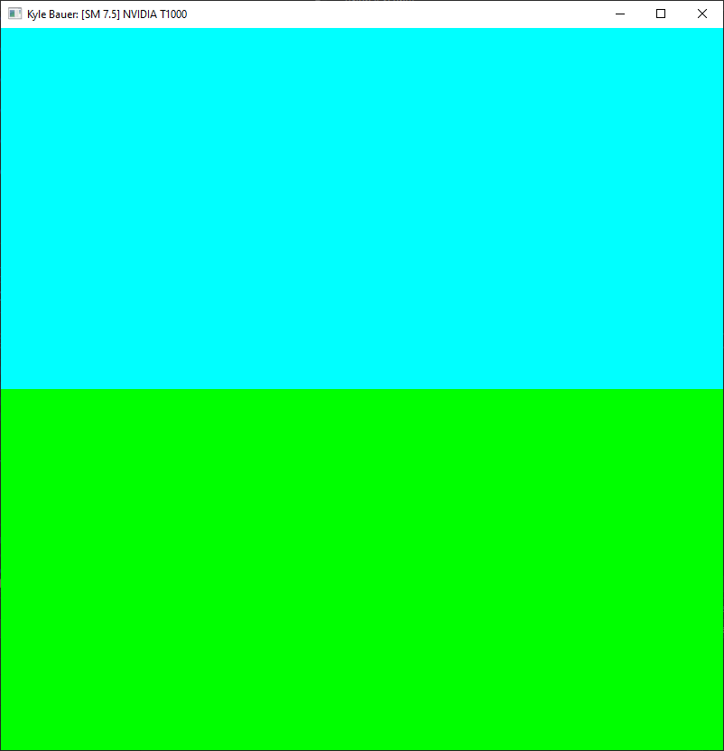
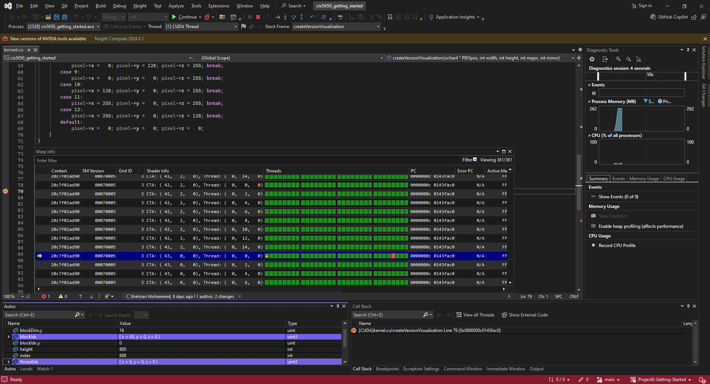
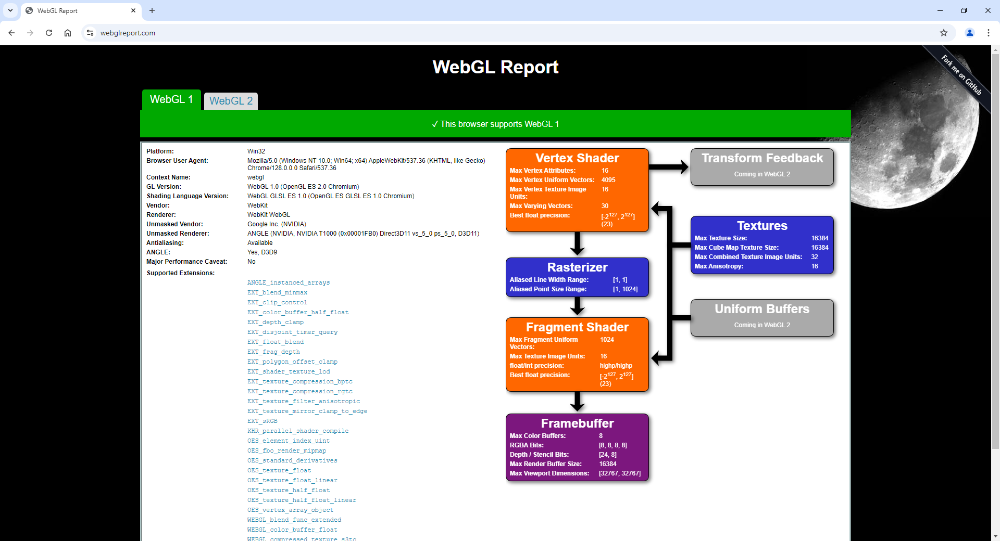
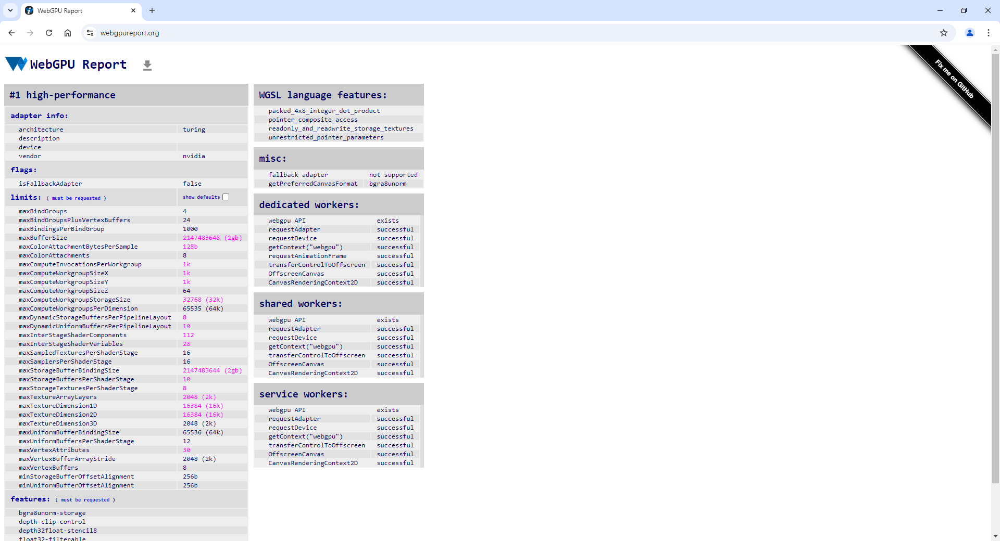

Project 0 Getting Started
====================

**University of Pennsylvania, CIS 5650: GPU Programming and Architecture, Project 0**

* Kyle Bauer
  * [LinkedIn](https://www.linkedin.com/in/kyle-bauer-75bb25171/), [personal website](), [twitter](https://x.com/KyleBauer414346), etc.
* Tested on: Windows 10, i-7 12700 @ 2.1GHz 32GB, NVIDIA T1000 4GB (CETS Virtual Lab)

Part 2.1.2

Part 2.1.3

Part 2.1.4

Waiting for response on CETS Virtual Lab computers.

Part 2.1.5

Nsight Compute does not support Nvidia 10 Series GPUs' Pascal architecture. Waiting for response on CETS Virtual Lab computers.

Part 2.2

Part 2.3

